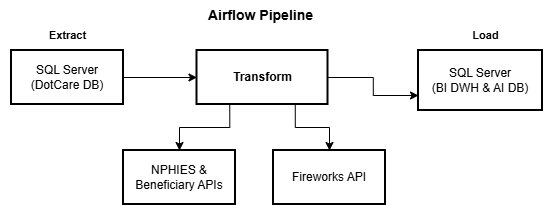
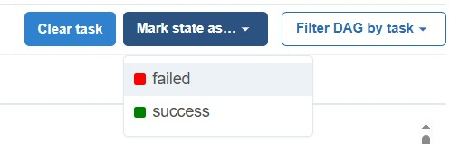

# Insurance ETL Pipeline - (Eligibility - Claim Predictions - Medical Resubmission)

An Apache Airflow-based ETL pipeline system for processing claims.

## Table of Contents

- [Overview](#overview)
- [Architecture](#architecture)
- [Features](#features)
- [Prerequisites](#prerequisites)
- [Installation](#installation)
- [Configuration](#configuration)
- [DAGs Overview](#dags-overview)
- [Project Structure](#project-structure)
- [Usage](#usage)
- [Monitoring](#monitoring)
- [Troubleshooting](#troubleshooting)
- [Contributing](#contributing)
- [Authors](#authors)

## Overview

This project implements automated ETL pipelines for insurance operations, including:

- **Eligibility Check**: Real-time insurance eligibility checking via NPHIES API
- **Medical Predictions**: AI-powered medical necessity rejection predictions for claims
- **Resubmission Copilot**: Automated justification generation for rejected claims

## Architecture

### Technology Stack

- **Orchestration**: Apache Airflow 2.10.4
- **Database**: MySQL 8.0 (Airflow metadata), SQL Server (data sources)
- **AI/ML**: 
  - LangChain + Fireworks AI (DeepSeek-V3)
  - OpenAI API integration
- **Containerization**: Docker + Docker Compose
- **Python**: 3.10

### System Design



## Features

### 1. Eligibility Verification (`eligibility_etl_pipeline.py`)

- **Schedule**: Every 4 hours (12:00 AM, 4 AM, 8 AM, 12 PM, 4 PM, 8 PM)
- **Purpose**: Verify patient insurance eligibility through NPHIES gateway
- **Processes**:
  - Extract patient visit data from DOT-CARE database
  - Sends requests to Beneficiary and Eligibility APIs for insurance status and details
  - Parse and validate the responses
  - Store results in BI Claims DWH

**Key Features**:
- Parallel transformation (Iqama and Eligibility processing)
- 30-minute overlap window to prevent data gaps
- Automatic retry mechanism

### 2. Medical Predictions (`predictions_etl_pipeline.py` & `clinics_predictions_etl_pipeline.py`)

- **Schedule**: Every 4 hours (12:00 AM, 4 AM, 8 AM, 12 PM, 4 PM, 8 PM)
- **Purpose**: AI-powered prediction of medical necessity for claimed services in AHJ and all clinics
- **Processes**:
  - Extract claims with recent updates
  - Analyze patient information, diagnosis, and ordered services
  - Generate approval/rejection predictions with reasoning
  - Store predictions and history

**Key Features**:
- Automatic handling of duplicate services
- JSON schema validation
- Comprehensive error handling and retry logic

### 3. Resubmission Copilot (`resubmission_etl_pipeline.py` & `clinics_resubmission_etl_pipeline.py`)

- **Schedule**: Daily at 7:30 AM (clinics), 7:00 AM (AHJ)
- **Purpose**: Generate medical justifications for rejected claims in AHJ and all clinics
- **Processes**:
  - Extract claims rejected in the previous day
  - Analyze rejection reasons and patient context
  - Generate compelling medical justifications for resubmission

**Key Features**:
- Handles multiple rejection types (MN-1, AD-1-4, AD-3-5, drug interactions)
- Context-aware justification generation
- Automated retry on failures

## Prerequisites

- Docker and Docker Compose
- ODBC Driver 17 for SQL Server
- Access to NPHIES API endpoints
- Fireworks AI API key
- SMTP server for email notifications

## Installation

### 1. Clone the Repository

```bash
git clone https://github.com/Andalusia-Data-Science-Team/eligibility-etl-airflow.git
cd eligibility-etl-airflow
```

### 2. Configure Environment Variables

Create a `.env` file in the project root:

```env
FIREWORKS_API_KEY=your_fireworks_api_key
```

### 3. Configure Database Credentials

Create `passcode.json` in the project root, structured like the following example:

```json
{
  "DB_NAMES": {
    "Replica": {
      "Server": "your_server",
      "Database": "your_db",
      "UID": "username",
      "PWD": "password",
      "driver": "ODBC Driver 17 for SQL Server"
    },
    "BI": {
      "Server": "bi_server",
      "Database": "bi_db",
      "UID": "username",
      "PWD": "password",
      "driver": "ODBC Driver 17 for SQL Server"
    },
    "AI": {
      "Server": "ai_server",
      "Database": "ai_db",
      "UID": "username",
      "PWD": "password",
      "driver": "ODBC Driver 17 for SQL Server"
    },
    "SNB": { /* Clinic-specific config */ },
    "AKW": { /* Clinic-specific config */ },
    "ALW": { /* Clinic-specific config */ },
    "MKR": { /* Clinic-specific config */ },
    "LCH": { /* Clinic-specific config */ }
  }
}
```

### 4. Build and Start Services

```bash
# Build Docker images
docker compose build

# Start services
docker compose up -d

# Check service status
docker compose ps
```

### 5. Initialize Airflow

```bash
# Access Airflow webserver
docker-compose exec airflow-webserver bash

# Initialize database (first time only)
airflow db init

# Create admin user
airflow users create \
    --username admin \
    --password admin \
    --firstname Admin \
    --lastname User \
    --role Admin \
    --email admin@example.com
```

## Configuration

### Email Notifications

Update the email list in `src/etl_utils.py`:

```python
email_list = [
    "your.email@company.com",
]
```

### SMTP Configuration

The system uses an internal SMTP server at `aws-ex-07.andalusia.loc:25`. Update in `src/etl_utils.py` if needed.

### DAG Configuration

Each DAG can be configured with:

- **Schedule**: Adjust `schedule_interval` in DAG definition
- **Retries**: Modify `default_args['retries']`
- **Retry Delay**: Change `default_args['retry_delay']`
- **Max Active Runs**: Set `max_active_runs` in DAG decorator

## DAGs Overview

### Eligibility Job

**Tasks**:
1. `extract_data`: Extract most recent visits data from database
2. `transform_iqama`: Fetch insurance details via Beneficiary API
3. `transform_eligibility`: Check eligibility via NPHIES
4. `load_data`: Store results in BI Claims DWH
5. `cleanup_extraction_file`: Remove temporary files

### Predictions Job (AHJ) & Clinics Predictions Job

**Tasks**:
1. `extract`: Extract most recently updated claims
2. `transform`: Generate claim outcome predictions
3. `load`: Store predictions and history
4. `cleanup_extraction_file`: Clean temporary files

### Resubmission Jobs (AHJ) & Clinics Resubmission Job

**Tasks**:
1. `extract`: Get rejected claims from previous day
2. `transform`: Generate AI justifications for resubmission
3. `load`: Store justifications
4. `cleanup_files`: Clean temporary files

## Project Structure

```
eligibility-etl-airflow/
├── dags/                          # Airflow DAG definitions
│   ├── eligibility_etl_pipeline.py
│   ├── predictions_etl_pipeline.py
│   ├── clinics_predictions_etl_pipeline.py
│   ├── resubmission_etl_pipeline.py
│   └── clinics_resubmission_etl_pipeline.py
├── src/                           # Core Python modules
│   ├── __init__.py
│   ├── eligibility.py            # Eligibility verification logic
│   ├── predictions.py            # AI prediction logic
│   ├── resubmission.py           # Resubmission justification logic
│   └── etl_utils.py              # Shared utilities
├── sql/                          # SQL queries
│   ├── eligibility_enhanced.sql
│   ├── claims_prediction.sql
│   └── resubmission.sql
├── docker-compose.yaml           # Docker services configuration
├── Dockerfile                    # Airflow container setup
├── pyproject.toml               # Python project configuration
├── setup.cfg                    # Setuptools configuration
├── passcode.json               # Database credentials (not in repo)
├── .env                        # Environment variables (not in repo)
└── .gitignore                  # Git ignore rules
```

## Usage

### Accessing Airflow UI

1. Navigate to `http://localhost:8080`
2. Login with admin credentials
3. View and manage DAGs from the dashboard

### Manual DAG Execution

**Via UI**:
1. Navigate to DAG page
2. Toggle DAG to "On"
3. Click "Trigger DAG" button

### Monitoring Logs

```bash
# View Airflow scheduler logs
docker logs eligibility-etl-airflow-airflow-scheduler-1 --tail 100

# View Airflow webserver logs
docker logs eligibility-etl-airflow-airflow-webserver-1 --tail 100

```


## Monitoring

### Key Metrics

- **DAG Success Rate**: Monitor in Airflow UI
- **Task Duration**: Check for performance degradation
- **Failure Alerts**: Automatic email notifications
- **Data Volume**: Track records processed per run

### Email Alerts

The system sends email notifications for:
- DAG failures
- Task failures
- Retry attempts (optional)

### Logs Location

- **Airflow Logs**: `./airflow-logs/` (mounted volume)
- **Application Logs**: View in Airflow UI or via CLI
- **Scheduler Logs**: `scheduler.log` in container

## Troubleshooting

### Common Issues

**1. Database Connection Errors**

Common issues:
- Login timeout expired
- Login failed for user <user>

Check the error message in Airflow logs
Make sure the credentials being used are correct
Kindly contact Data Engineering team / DBA if the issue persists

**2. API Timeout Issues**

If you notice a relatively long task duration and see 'Heartbeat recovered' multiple times in task logs
This might be an API related issue, causing the task to freeze, it never completes or fails

- Mark the task as failed and retry
- If the issue keeps recurring, try to increase `request_timeout` in Fireworks model configs

**3. Memory Issues**


This is most likely a memory issue, to make sure look for 'Out of Memory (OOM)' errors in webserver logs

```bash
# Try to clear memory using the following command and restart the containers
docker system prune -a
docker compose down
docker compose up -d
```

**4. Failed Task Recovery**



For manual failure retrying:
- Mark state as failed through the UI
- Then clear task

## Contributing

### Development Setup

1. Create a virtual environment:
```bash
python -m venv venv
source venv/bin/activate  # Linux/Mac
```

2. Install dependencies:
```bash
pip install -e .
```

3. Code formatting:
```bash
black src/ dags/
isort src/ dags/
```

### Code Standards

- Follow PEP 8 style guide
- Add type hints for function parameters
- Write comprehensive docstrings
- Update documentation for changes

## Authors

**AI Team**
- [Muhammed Amr](https://github.com/Mhammedammr)
- [Nadine Muhammad](https://github.com/Nadine-Muhammad)
---

**Last Updated**: December 2025
**Version**: 0.0.1  
**Built and Maintained By**: Andalusia Data Science Team